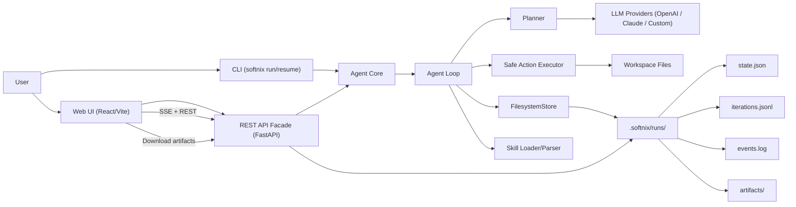

# Softnix Agentic Agent

CLI-first agent framework ที่ทำงานตาม flow:

`Task -> Agent Loop -> Filesystem Persistence -> Loop ต่อ`

รองรับ:
- Skills มาตรฐาน `SKILL.md`
- LLM Providers: `OpenAI`, `Claude`, `OpenAI-compatible custom endpoint`
- Safe action execution (allowlist)
- Core Memory แบบ markdown-first (`PROFILE.md`/`SESSION.md` + pending/inferred flow)
- Local REST API facade สำหรับต่อยอด Desktop/Web

## โครงสร้างหลัก

- `src/softnix_agentic_agent/cli.py` คำสั่ง CLI
- `src/softnix_agentic_agent/agent/loop.py` วน iteration หลัก
- `src/softnix_agentic_agent/agent/planner.py` เรียก LLM เพื่อวางแผน action
- `src/softnix_agentic_agent/agent/executor.py` execute action แบบปลอดภัย
- `src/softnix_agentic_agent/storage/filesystem_store.py` persist state/iterations/events
- `src/softnix_agentic_agent/memory/*` memory store/service สำหรับ profile/session/pending memory
- `src/softnix_agentic_agent/skills/*` parser/loader สำหรับ `SKILL.md`
- `src/softnix_agentic_agent/providers/*` adapter ของ provider
- `src/softnix_agentic_agent/api/app.py` REST facade

## Architecture Diagram



ลำดับการทำงานหลัก:
1. รับ `task` จาก CLI หรือ Web UI
2. Agent Core เริ่ม `Agent Loop` และเรียก `Planner` เพื่อขอแผนจาก LLM Provider
3. `Safe Action Executor` ทำ action ที่อนุญาตและเขียนไฟล์ใน workspace
4. `FilesystemStore` บันทึก state/iterations/events/artifacts ต่อเนื่องทุก iteration
5. Core Memory update/resolve บริบทจาก `PROFILE.md`/`SESSION.md` แล้ว inject เข้า planner prompt
6. API/Web UI อ่านสถานะล่าสุดและ timeline จาก run storage แบบ near real-time

## ติดตั้ง

```bash
python -m venv .venv
source .venv/bin/activate
pip install -e '.[dev]'
```

## ตั้งค่า Environment

คัดลอก `.env.example` และกำหนดค่า API key ตาม provider ที่ใช้
ตัวระบบจะโหลดไฟล์ `.env` อัตโนมัติจาก current working directory ตอนรันคำสั่ง `softnix`

ตัวอย่างที่ต้องมี:
- `SOFTNIX_OPENAI_API_KEY` เมื่อใช้ `openai`
- `SOFTNIX_CLAUDE_API_KEY` เมื่อใช้ `claude`
- `SOFTNIX_CUSTOM_BASE_URL` (+ optional key) เมื่อใช้ `custom`

ตัวเลือกด้าน security:
- `SOFTNIX_API_KEY` เปิด API key protection ให้ทุก endpoint (ยกเว้น `/health`, `/docs`, `/openapi.json`)
- `SOFTNIX_CORS_ORIGINS` กำหนด origin ที่อนุญาต (comma-separated)
- `SOFTNIX_CORS_ALLOW_CREDENTIALS` (`true`/`false`)
- `SOFTNIX_EXEC_TIMEOUT_SEC` timeout ต่อ action ที่รันคำสั่ง/โค้ด
- `SOFTNIX_MAX_ACTION_OUTPUT_CHARS` จำกัดขนาด output ต่อ action
- `SOFTNIX_MEMORY_PROFILE_FILE` ชื่อไฟล์ profile memory ใน workspace (default `PROFILE.md`)
- `SOFTNIX_MEMORY_SESSION_FILE` ชื่อไฟล์ session memory ใน workspace (default `SESSION.md`)
- `SOFTNIX_MEMORY_POLICY_PATH` path ของ global policy memory (admin-managed only)
- `SOFTNIX_MEMORY_PROMPT_MAX_ITEMS` จำนวน memory items สูงสุดที่ inject เข้า planner prompt
- `SOFTNIX_MEMORY_INFERRED_MIN_CONFIDENCE` ค่าขั้นต่ำ (0-1) สำหรับ staging inferred memory

## การใช้งาน CLI

### 1) Run task

```bash
softnix run --task "Build a Python course" --provider openai --max-iters 10 --workspace . --skills-dir examples/skills
```

### 2) Resume run เดิม

```bash
softnix resume --run-id <run_id>
```

### 3) List skills

```bash
softnix skills list --path examples/skills
```

### 4) เปิด API

```bash
softnix api serve --host 127.0.0.1 --port 8787
```

## REST API

- `POST /runs` เริ่ม run ใหม่
- `GET /runs` อ่านรายการ runs
- `GET /runs/{id}` อ่านสถานะ run
- `GET /runs/{id}/iterations` อ่าน iteration logs
- `GET /runs/{id}/stream` stream ความคืบหน้าแบบ SSE
- `GET /runs/{id}/stream?last_event_id=<n>` resume stream จาก event id ล่าสุด
- `GET /runs/{id}/events` อ่าน events log
- `GET /runs/{id}/memory/pending` อ่าน inferred pending memory ที่รอการยืนยัน
- `POST /runs/{id}/cancel` ส่งคำขอหยุด run
- `POST /runs/{id}/resume` สั่ง resume run
- `GET /skills` อ่านรายการ skills
- `GET /artifacts/{id}` อ่านรายการ artifacts
- `GET /artifacts/{id}/{path}` ดาวน์โหลด artifact
- `GET /health` ตรวจสถานะ provider connectivity/config
- `GET /system/config` อ่าน effective runtime config (safe fields)

เมื่อเปิด `SOFTNIX_API_KEY`:
- ทุก request ที่เข้าถึง API หลักต้องส่ง header `x-api-key: <your-key>`
- CORS preflight (`OPTIONS`) ยังทำงานได้ปกติสำหรับ origin ที่ allow ไว้

## Web UI (ChatGPT-like)

โฟลเดอร์ `web-ui/` เป็น frontend สำหรับใช้งานกับ API backend โดยใช้:
- React + Vite
- Tailwind CSS + shadcn-style components
- Framer Motion animations
- Streaming markdown renderer และ AI-native UI blocks

### รัน Backend

```bash
softnix api serve --host 127.0.0.1 --port 8787
```

ควรเปิด `venv` ก่อนทุกครั้ง:

```bash
source .venv/bin/activate
```

### รัน Web UI

```bash
cd web-ui
npm install
npm run dev
```

ค่า default API คือ `http://127.0.0.1:8787` และ override ได้ด้วย env:

```bash
VITE_API_BASE_URL=http://127.0.0.1:8787
VITE_SOFTNIX_API_KEY=
```

### เข้าใช้งาน Web UI

1. เปิดเบราว์เซอร์ที่ `http://127.0.0.1:5173`
2. กรอก task/provider/model แล้วกด `Start Run`
3. ดู conversation timeline และใช้ปุ่ม `Cancel`/`Resume` ได้ตรงนี้เลย

ข้อจำกัดปัจจุบันของ Web UI:
- ยังไม่มีปุ่ม Confirm/Reject pending memory โดยตรงในหน้า UI
- pending memory ตรวจได้ผ่าน API `GET /runs/{id}/memory/pending`

## Deployment Config

มี deployment templates แยก environment สำหรับ backend/frontend ที่ `deploy/env/`

ไฟล์สำคัญ:
- `deploy/env/backend.dev.template`
- `deploy/env/backend.staging.template`
- `deploy/env/backend.prod.template`
- `deploy/env/frontend.dev.template`
- `deploy/env/frontend.staging.template`
- `deploy/env/frontend.prod.template`

ดูขั้นตอนใช้งานทั้งหมดที่ `deploy/README.md`
และไฟล์ compose พร้อมใช้ที่:
- `deploy/docker-compose.dev.yml`
- `deploy/docker-compose.staging.yml`

## รูปแบบไฟล์ Persistence

สำหรับแต่ละ run จะถูกเก็บที่:

- `.softnix/runs/<run_id>/state.json`
- `.softnix/runs/<run_id>/iterations.jsonl`
- `.softnix/runs/<run_id>/artifacts/`
- `.softnix/runs/<run_id>/events.log`

## Safe Execution Policy

Action ที่รองรับในรุ่นแรก:
- `list_dir`
- `read_file`
- `write_workspace_file`
- `write_file` (alias ของ `write_workspace_file`)
- `run_safe_command`
- `run_shell_command` (alias ของ `run_safe_command`)
- `run_python_code`
- `web_fetch`

ข้อจำกัด:
- ห้าม path ออกนอก workspace
- shell command ต้องอยู่ใน allowlist (`SOFTNIX_SAFE_COMMANDS`)
- token เสี่ยง (`sudo`, `curl`, `wget`, `ssh`, `scp`, `mv`) ถูก block
- `rm` อนุญาตเมื่ออยู่ใน allowlist และลบได้เฉพาะ path ภายใน workspace

## Core Memory (Markdown-first)

- ระบบสร้างและใช้ `PROFILE.md` และ `SESSION.md` ใน workspace อัตโนมัติ
- รองรับคำสั่งจากผู้ใช้แบบธรรมชาติ เช่น `จำไว้ว่า response.tone = concise`
- รองรับ TTL ในคำสั่งจำแบบ explicit เช่น `remember response.verbosity = concise for 8h`
- รองรับ inferred preference แบบ pending (ยังไม่ commit ถาวร) จากข้อความเช่น `ขอสั้นๆ`, `ขอเป็นข้อๆ`
- ยืนยัน pending ด้วย `ยืนยันให้จำ <key>` หรือยกเลิกด้วย `ไม่ต้องจำ <key>`
- เฉพาะ inferred ที่มี confidence มากกว่าหรือเท่ากับ `SOFTNIX_MEMORY_INFERRED_MIN_CONFIDENCE` เท่านั้นที่จะถูก stage
- memory ที่ resolve แล้วจะถูก inject เข้า planner prompt ทุก iteration
- มี auto compact ต่อ iteration สำหรับลบ memory ที่หมดอายุและ deduplicate key ซ้ำใน `PROFILE.md`/`SESSION.md`
- audit การเปลี่ยน memory ถูกเก็บที่ `.softnix/runs/<run_id>/memory_audit.jsonl`
- `POLICY.md` ถูกออกแบบให้เป็น admin-managed only และอยู่นอก user workspace path ปกติ
- มี endpoint ตรวจ pending memory: `GET /runs/{run_id}/memory/pending`

### One-click test script

รันสคริปต์ทดสอบครบ flow หลัก (explicit, ttl, inferred-pending, confirm, reject):

```bash
cd /Volumes/Seagate/myapp/Softnix-Agentic-Agent
./scripts/test_core_memory_oneclick.sh
```

หมายเหตุ:
- สคริปต์จะพยายาม start backend อัตโนมัติ (ใช้ `softnix` หรือ `.venv/bin/softnix` หรือ `uv run softnix`)
- หากมี backend รันอยู่แล้ว จะใช้ instance นั้นทันที
- สามารถ override ได้ด้วย `API_BASE=http://127.0.0.1:8787 ./scripts/test_core_memory_oneclick.sh`

## หมายเหตุสำหรับ Desktop/Web

รุ่นปัจจุบันมี Web UI ใช้งานได้แล้วสำหรับ run/timeline/artifacts และการควบคุม run พื้นฐาน
โดย memory confirmation flow ยังใช้แนวทางผ่าน task text/API เป็นหลัก
