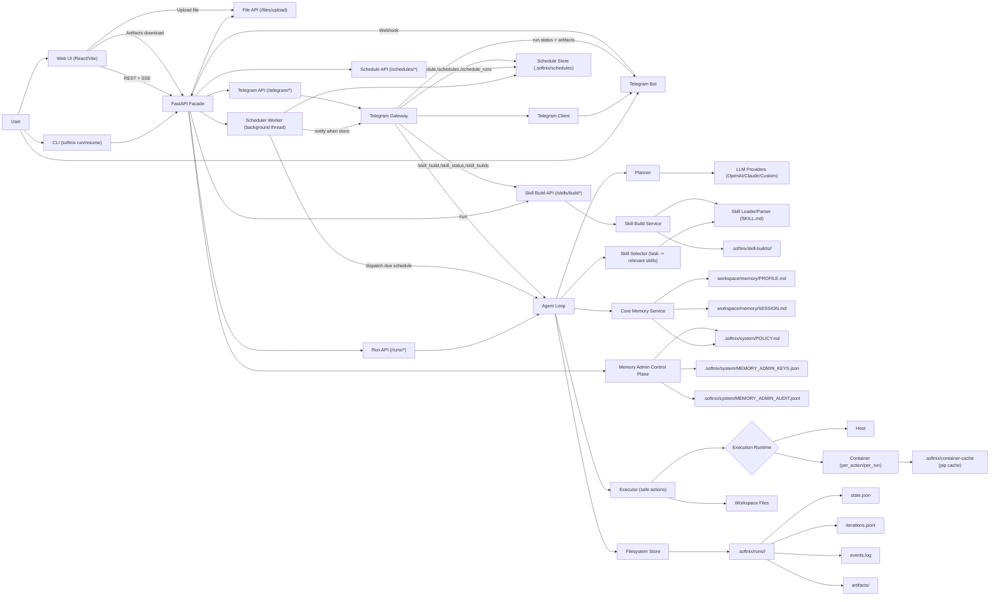

# Softnix Agentic Agent

CLI-first agent framework ที่ทำงานตาม flow:

`Task -> Agent Loop -> Filesystem Persistence -> Loop ต่อ`

รองรับ:
- Skills มาตรฐาน `SKILL.md`
- Skill-local secret ผ่านโฟลเดอร์ `.secret/` (ไม่ commit เข้า git)
- LLM Providers: `OpenAI`, `Claude`, `OpenAI-compatible custom endpoint`
- Safe action execution (allowlist)
- Core Memory แบบ markdown-first (`memory/PROFILE.md`/`memory/SESSION.md` + pending/inferred flow)
- Local REST API facade สำหรับต่อยอด Desktop/Web

## โครงสร้างหลัก

- `src/softnix_agentic_agent/cli.py` คำสั่ง CLI
- `src/softnix_agentic_agent/agent/loop.py` วน iteration หลัก
- `src/softnix_agentic_agent/agent/planner.py` เรียก LLM เพื่อวางแผน action
- `src/softnix_agentic_agent/agent/executor.py` execute action แบบปลอดภัย
- `src/softnix_agentic_agent/storage/filesystem_store.py` persist state/iterations/events
- `src/softnix_agentic_agent/memory/*` memory store/service สำหรับ profile/session/pending memory
- `src/softnix_agentic_agent/skills/*` parser/loader สำหรับ `SKILL.md`
- `src/softnix_agentic_agent/providers/*` adapter ของ provider
- `src/softnix_agentic_agent/api/app.py` REST facade

## Skill Secret Management

- สำหรับ skill ที่ต้องใช้ API key ให้เก็บไฟล์ลับไว้ที่ `skillpacks/<skill-name>/.secret/`
- ตัวอย่าง: `skillpacks/tavily-search/.secret/TAVILY_API_KEY`
- ระบบจะ materialize ไฟล์ใน `.secret/` ไปยัง `.softnix_skill_exec/.../.secret/` ตอนรัน skill script โดยอัตโนมัติ
- หาก task ของผู้ใช้มี API key ตรงๆ (เช่น `RESEND_API_KEY=...` หรือ `resend.api_key="..."`) ระบบจะ redact ก่อนส่งเข้า planner และย้ายค่าไปที่ `workspace/.secret/<KEY_NAME>` อัตโนมัติ
- `.gitignore` ถูกตั้งค่าให้ไม่เก็บ `skillpacks/**/.secret/` ใน git
- แนะนำให้ script รองรับทั้ง env var และไฟล์ `.secret` (env มาก่อน)
- คำสั่ง `softnix skills validate` จะเตือนทันทีถ้าเจอโฟลเดอร์ legacy `.secrets/`

## Architecture Diagram



ลำดับการทำงานหลัก:
1. รับ `task` จาก CLI หรือ Web UI
2. Agent Core เริ่ม `Agent Loop` และเรียก `Planner` เพื่อขอแผนจาก LLM Provider
3. `Skill Selector` คัดเฉพาะ skill ที่เกี่ยวข้องจาก task แล้วส่งให้ `Skill Loader/Parser` สร้าง context/contract
4. `Safe Action Executor` ทำ action ที่อนุญาตและเขียนไฟล์ใน workspace
5. `FilesystemStore` บันทึก state/iterations/events/artifacts ต่อเนื่องทุก iteration
6. Core Memory update/resolve บริบทจาก `memory/PROFILE.md`/`memory/SESSION.md` แล้ว inject เข้า planner prompt
7. API/Web UI อ่านสถานะล่าสุดและ timeline จาก run storage แบบ near real-time

## ติดตั้ง

```bash
python -m venv .venv
source .venv/bin/activate
pip install -e '.[dev]'
```

## ตั้งค่า Environment

คัดลอก `.env.example` และกำหนดค่า API key ตาม provider ที่ใช้
ตัวระบบจะโหลดไฟล์ `.env` อัตโนมัติจาก current working directory ตอนรันคำสั่ง `softnix`

ตัวอย่างที่ต้องมี:
- `SOFTNIX_OPENAI_API_KEY` เมื่อใช้ `openai`
- `SOFTNIX_CLAUDE_API_KEY` เมื่อใช้ `claude`
- `SOFTNIX_CUSTOM_BASE_URL` (+ optional key) เมื่อใช้ `custom`

ตัวเลือกด้าน security:
- `SOFTNIX_API_KEY` เปิด API key protection ให้ทุก endpoint (ยกเว้น `/health`, `/docs`, `/openapi.json`)
- `SOFTNIX_CORS_ORIGINS` กำหนด origin ที่อนุญาต (comma-separated)
- `SOFTNIX_CORS_ALLOW_CREDENTIALS` (`true`/`false`)
- `SOFTNIX_SKILL_BUILDS_DIR` path เก็บ skill build jobs/staging logs (default `.softnix/skill-builds`)
- `SOFTNIX_MAX_ITERS` จำนวน iteration สูงสุดต่อ run (hard cap ของ loop)
- `SOFTNIX_EXEC_TIMEOUT_SEC` timeout ต่อ action ที่รันคำสั่ง/โค้ด
- `SOFTNIX_EXEC_RUNTIME` โหมด execution runtime (`host` หรือ `container`)
- `SOFTNIX_EXEC_CONTAINER_LIFECYCLE` lifecycle ของ container (`per_action` หรือ `per_run`)
- `SOFTNIX_EXEC_CONTAINER_IMAGE` container image ที่ใช้เมื่อ runtime=container
- `SOFTNIX_EXEC_CONTAINER_IMAGE_PROFILE` strategy เลือก image (`auto|base|web|data|scraping|ml|qa`)
- `SOFTNIX_EXEC_CONTAINER_IMAGE_BASE` image สำหรับงานทั่วไป
- `SOFTNIX_EXEC_CONTAINER_IMAGE_WEB` image สำหรับงาน web-centric
- `SOFTNIX_EXEC_CONTAINER_IMAGE_DATA` image สำหรับงาน data/python libs
- `SOFTNIX_EXEC_CONTAINER_IMAGE_SCRAPING` image สำหรับงาน scraping/browser-heavy
- `SOFTNIX_EXEC_CONTAINER_IMAGE_ML` image สำหรับงาน machine learning
- `SOFTNIX_EXEC_CONTAINER_IMAGE_QA` image สำหรับงาน QA/testing
- `SOFTNIX_EXEC_CONTAINER_NETWORK` network mode ของ container runtime (แนะนำ `none`)
- `SOFTNIX_EXEC_CONTAINER_CPUS` จำกัด CPU สำหรับ container runtime
- `SOFTNIX_EXEC_CONTAINER_MEMORY` จำกัด memory สำหรับ container runtime
- `SOFTNIX_EXEC_CONTAINER_PIDS_LIMIT` จำกัดจำนวน process ภายใน container
- `SOFTNIX_EXEC_CONTAINER_CACHE_DIR` path cache สำหรับ dependency/runtime cache
- `SOFTNIX_EXEC_CONTAINER_PIP_CACHE_ENABLED` เปิด/ปิด pip cache mount ใน container
- `SOFTNIX_EXEC_CONTAINER_ENV_VARS` allowlist env vars ที่จะส่งเข้า container runtime (comma-separated, default `RESEND_API_KEY`)
- `SOFTNIX_EXEC_CONTAINER_RUN_VENV_ENABLED` เปิด run-scoped virtualenv ใน container runtime (default `true`)
- `SOFTNIX_EXEC_CONTAINER_AUTO_INSTALL_ENABLED` เปิด auto-install dependency เมื่อเจอ `ModuleNotFoundError` ใน container runtime (default `true`)
- `SOFTNIX_EXEC_CONTAINER_AUTO_INSTALL_MAX_MODULES` จำกัดจำนวน module ที่ระบบ auto-install ต่อ action (default `6`)
- `SOFTNIX_MAX_ACTION_OUTPUT_CHARS` จำกัดขนาด output ต่อ action
- `SOFTNIX_RUN_MAX_WALL_TIME_SEC` จำกัดเวลารวมต่อ run (second) เพื่อกันงานวนไม่จบ (default `900`)
- `SOFTNIX_PLANNER_PARSE_ERROR_STREAK_THRESHOLD` จำนวนครั้งติดกันของ `planner_parse_error` ก่อนหยุด (default `3`)
- `SOFTNIX_CAPABILITY_FAILURE_STREAK_THRESHOLD` จำนวนครั้งติดกันของ capability failure เดิมก่อนหยุด (default `4`)
- `SOFTNIX_OBJECTIVE_STAGNATION_REPLAN_THRESHOLD` จำนวนรอบที่ objective ไม่คืบหน้าก่อนบังคับเข้า recovery guidance mode (default `3`)
- `SOFTNIX_PLANNER_RETRY_ON_PARSE_ERROR` เปิด/ปิด planner retry ใน iteration เดียวกันเมื่อ parse JSON ไม่ผ่าน (default `true`)
- `SOFTNIX_PLANNER_RETRY_MAX_ATTEMPTS` จำนวนความพยายามสูงสุดของ planner ต่อ iteration เมื่อเจอ parse error (default `2`)
- `SOFTNIX_WEB_FETCH_TLS_VERIFY` เปิด/ปิด TLS certificate verification สำหรับ `web_fetch` (default `true`)
- `SOFTNIX_MEMORY_PROFILE_FILE` ชื่อไฟล์ profile memory ใน workspace (default `memory/PROFILE.md`)
- `SOFTNIX_MEMORY_SESSION_FILE` ชื่อไฟล์ session memory ใน workspace (default `memory/SESSION.md`)
- `SOFTNIX_MEMORY_POLICY_PATH` path ของ global policy memory (admin-managed only)
- `SOFTNIX_MEMORY_PROMPT_MAX_ITEMS` จำนวน memory items สูงสุดที่ inject เข้า planner prompt
- `SOFTNIX_MEMORY_INFERRED_MIN_CONFIDENCE` ค่าขั้นต่ำ (0-1) สำหรับ staging inferred memory
- `SOFTNIX_MEMORY_PENDING_ALERT_THRESHOLD` จำนวน pending ขั้นต่ำที่จะเริ่ม log alert backlog
- `SOFTNIX_MEMORY_ADMIN_KEY` legacy admin key เดี่ยว (ยังรองรับ)
- `SOFTNIX_MEMORY_ADMIN_KEYS` รายการ admin keys จาก env (comma-separated)
- `SOFTNIX_MEMORY_ADMIN_KEYS_PATH` path keyring สำหรับ local rotated keys
- `SOFTNIX_MEMORY_ADMIN_AUDIT_PATH` path audit log ของ admin operations
- `SOFTNIX_TELEGRAM_ENABLED` เปิด/ปิด Telegram Gateway (`true`/`false`)
- `SOFTNIX_TELEGRAM_MODE` โหมด gateway (`polling` หรือ `webhook`)
- `SOFTNIX_TELEGRAM_BOT_TOKEN` bot token จาก Telegram
- `SOFTNIX_TELEGRAM_ALLOWED_CHAT_IDS` รายการ chat id ที่อนุญาต (comma-separated)
- `SOFTNIX_TELEGRAM_WEBHOOK_SECRET` secret token สำหรับ verify webhook header
- `SOFTNIX_TELEGRAM_POLL_INTERVAL_SEC` polling interval (ใช้กับ worker/poll mode)
- `SOFTNIX_TELEGRAM_MAX_TASK_CHARS` จำกัดความยาว task ผ่าน `/run`
- `SOFTNIX_TELEGRAM_NATURAL_MODE_ENABLED` เปิดโหมดใช้งานแบบธรรมชาติ (ข้อความปกติ = task)
- `SOFTNIX_TELEGRAM_RISKY_CONFIRMATION_ENABLED` เปิดการขอยืนยันก่อนรันงานเสี่ยง
- `SOFTNIX_TELEGRAM_CONFIRMATION_TTL_SEC` อายุของคำขอยืนยันงานเสี่ยง (วินาที)
- `SOFTNIX_SCHEDULER_ENABLED` เปิด/ปิด scheduler worker สำหรับงานตั้งเวลา
- `SOFTNIX_SCHEDULER_DIR` path เก็บ schedule definitions/history
- `SOFTNIX_SCHEDULER_POLL_INTERVAL_SEC` ความถี่ที่ worker ตรวจงานที่ถึงเวลา
- `SOFTNIX_SCHEDULER_MAX_DISPATCH_PER_TICK` จำนวนงานสูงสุดที่ dispatch ต่อรอบ
- `SOFTNIX_SCHEDULER_DEFAULT_TIMEZONE` timezone default ตอนสร้าง schedule

## การใช้งาน CLI

### 1) Run task

```bash
softnix run --task "Build a Python course" --provider openai --max-iters 10 --workspace . --skills-dir skillpacks
```

### 2) Resume run เดิม

```bash
softnix resume --run-id <run_id>
```

### 3) List skills

```bash
softnix skills list --path skillpacks
```

### 4) Create skill scaffold (พร้อม `.secret` และ smoke test)

```bash
softnix skills create \
  --path skillpacks \
  --name "order-status" \
  --description "check order status via API" \
  --guidance "รับ order id จากผู้ใช้ แล้วสรุปสถานะสั้นๆ" \
  --api-key-name ORDER_API_KEY \
  --api-key-value "<REAL_KEY>" \
  --endpoint-template "/orders/{item_id}"
```

ผลลัพธ์:
- สร้างโครง `SKILL.md`, `scripts/check_status.py`, `references/NOTES.md`
- เก็บ key ที่ `skillpacks/order-status/.secret/ORDER_API_KEY`
- รัน `--self-test` อัตโนมัติ และ validate ความพร้อม

### 5) Validate skill readiness

```bash
softnix skills validate --path skillpacks --name order-status --smoke --json
```

เงื่อนไขผ่าน:
- โครงสร้าง skill ถูกต้อง
- script compile ได้
- smoke test ผ่าน (ถ้าเป็น template ที่รองรับ)
- ไม่มีปัญหา `.secret` (เช่น key ว่าง/placeholder)

### 6) Skill Build Job (no-code via API)

กรณีต้องการให้ระบบ scaffold + validate + install skill อัตโนมัติแบบ asynchronous:

```bash
curl -sS -X POST http://127.0.0.1:8787/skills/build \
  -H 'Content-Type: application/json' \
  -d '{
    "task":"ช่วยสร้าง skill ตรวจสอบสถานะคำสั่งซื้อ",
    "api_key_name":"ORDER_API_KEY",
    "api_key_value":"<REAL_KEY>",
    "endpoint_template":"/orders/{item_id}",
    "allow_overwrite":true
  }'
```

ติดตามสถานะ:

```bash
curl -sS http://127.0.0.1:8787/skills/builds/<job_id>
curl -sS http://127.0.0.1:8787/skills/builds/<job_id>/events
```

### 7) เปิด API

```bash
softnix api serve --host 127.0.0.1 --port 8787
```

## REST API

- `POST /runs` เริ่ม run ใหม่
- `GET /runs` อ่านรายการ runs
- `GET /runs/{id}` อ่านสถานะ run
- `GET /runs/{id}/iterations` อ่าน iteration logs
- `GET /runs/{id}/stream` stream ความคืบหน้าแบบ SSE
- `GET /runs/{id}/stream?last_event_id=<n>` resume stream จาก event id ล่าสุด
- `GET /runs/{id}/events` อ่าน events log
- `POST /files/upload` อัปโหลดไฟล์เข้า workspace (payload: `filename`, `content_base64`, `path`)
- `GET /runs/{id}/memory/pending` อ่าน inferred pending memory ที่รอการยืนยัน
- `POST /runs/{id}/memory/confirm` ยืนยัน pending memory ด้วย key แบบ explicit
- `POST /runs/{id}/memory/reject` ปฏิเสธ pending memory ด้วย key แบบ explicit
- `GET /runs/{id}/memory/metrics` อ่าน memory metrics (pending backlog / compact failures / policy tools)
- `POST /admin/memory/policy/reload` trigger policy reload summary (ต้องใช้ `x-memory-admin-key`)
- `GET /admin/memory/keys` อ่านรายการ admin keys (masked metadata)
- `POST /admin/memory/keys/rotate` เพิ่ม local admin key ใหม่
- `POST /admin/memory/keys/revoke` revoke local admin key
- `GET /admin/memory/audit` อ่าน admin audit log
- `POST /runs/{id}/cancel` ส่งคำขอหยุด run
- `POST /runs/{id}/resume` สั่ง resume run
- `GET /skills` อ่านรายการ skills
- `POST /skills/build` เริ่ม skill build job (staging -> validate -> install)
- `GET /skills/builds` อ่านรายการ skill build jobs
- `GET /skills/builds/{job_id}` อ่านสถานะ skill build job
- `GET /skills/builds/{job_id}/events` อ่าน timeline ของ skill build job
- `GET /artifacts/{id}` อ่านรายการ artifacts
- `GET /artifacts/{id}/{path}` ดาวน์โหลด artifact
- `GET /health` ตรวจสถานะ provider connectivity/config
- `GET /system/config` อ่าน effective runtime config (safe fields)
- `POST /telegram/webhook` รับ Telegram webhook update (public endpoint, แนะนำให้เปิด secret verify)
- `POST /telegram/poll` ดึง updates แบบ manual 1 รอบ (สำหรับ dev/polling)
- `GET /telegram/metrics` อ่าน command/error/latency metrics ของ Telegram gateway
- `POST /schedules` สร้างงานตั้งเวลา (one-time/cron)
- `POST /schedules/parse` แปลงข้อความธรรมชาติเป็น schedule payload
- `POST /schedules/from-text` สร้าง schedule จากข้อความธรรมชาติโดยตรง
- `GET /schedules` อ่านรายการ schedules
- `GET /schedules/{id}` อ่านรายละเอียด schedule
- `PATCH /schedules/{id}` แก้ไข schedule (เช่น enable/disable)
- `DELETE /schedules/{id}` ลบ schedule
- `POST /schedules/{id}/run-now` สั่งรันทันที
- `GET /schedules/{id}/runs` อ่านประวัติ run ของ schedule

เมื่อเปิด `SOFTNIX_API_KEY`:
- ทุก request ที่เข้าถึง API หลักต้องส่ง header `x-api-key: <your-key>`
- CORS preflight (`OPTIONS`) ยังทำงานได้ปกติสำหรับ origin ที่ allow ไว้
- `POST /telegram/webhook` ยังเป็น public path เพื่อรองรับ Telegram callback โดยให้ป้องกันด้วย `SOFTNIX_TELEGRAM_WEBHOOK_SECRET`

## Web UI (ChatGPT-like)

โฟลเดอร์ `web-ui/` เป็น frontend สำหรับใช้งานกับ API backend โดยใช้:
- React + Vite
- Tailwind CSS + shadcn-style components
- Framer Motion animations
- Streaming markdown renderer และ AI-native UI blocks

### รัน Backend

```bash
softnix api serve --host 127.0.0.1 --port 8787
```

ควรเปิด `venv` ก่อนทุกครั้ง:

```bash
source .venv/bin/activate
```

### รัน Web UI

```bash
cd web-ui
npm install
npm run dev
```

ค่า default API คือ `http://127.0.0.1:8787` และ override ได้ด้วย env:

```bash
VITE_API_BASE_URL=http://127.0.0.1:8787
VITE_SOFTNIX_API_KEY=
VITE_SOFTNIX_MEMORY_ADMIN_KEY=
```

หมายเหตุ:
- หากตั้ง `VITE_SOFTNIX_MEMORY_ADMIN_KEY` Web UI จะแสดงปุ่ม `Reload Policy` (เรียก `POST /admin/memory/policy/reload`)

### เข้าใช้งาน Web UI

1. เปิดเบราว์เซอร์ที่ `http://127.0.0.1:5173`
2. กรอก task แล้วกด `Start Run` (provider/model/max iterations ใช้ค่าจาก backend config)
3. ดู conversation timeline และใช้ปุ่ม `Cancel`/`Resume` ได้ตรงนี้เลย
4. ถ้าต้องใช้ไฟล์ input (เช่น PDF/CSV) ใช้กล่อง `Upload file to workspace` แล้วอ้าง path ที่ได้ใน task เช่น `inputs/invoice.pdf`

ข้อจำกัดปัจจุบันของ Web UI:
- ยังไม่มีหน้าจัดการ policy admin (reload ยังเรียกผ่าน API)

## Scheduling (Cron-like)

รองรับการตั้งเวลางานล่วงหน้าแบบ one-time และ recurring

ตัวอย่างแปลงข้อความธรรมชาติ:

```bash
curl -sS -X POST http://127.0.0.1:8787/schedules/parse \
  -H 'Content-Type: application/json' \
  -d '{"text":"วันนี้ 09:00 ช่วยสรุปข้อมูลจาก www.softnix.ai และข่าว AI","timezone":"Asia/Bangkok"}'
```

ตัวอย่างสร้าง schedule จากข้อความธรรมชาติโดยตรง:

```bash
curl -sS -X POST http://127.0.0.1:8787/schedules/from-text \
  -H 'Content-Type: application/json' \
  -d '{"text":"ทุกวัน 09:00 ช่วยสรุปข้อมูลจาก www.softnix.ai และข่าว AI","timezone":"Asia/Bangkok"}'
```

ตัวอย่างสั่งรันทันที (run-now):

```bash
curl -sS -X POST http://127.0.0.1:8787/schedules/<schedule_id>/run-now
```

## Web Intelligence Fallback Strategy

สำหรับงานค้นหา/สรุปข้อมูลเว็บไซต์ ระบบใช้แนวทาง 2 ชั้น:

1. `web_fetch` ก่อนเสมอ
- เร็วกว่า ต้นทุนต่ำกว่า และเพียงพอกับเว็บที่ไม่ซับซ้อน

2. fallback ไป browser automation เมื่อข้อมูลไม่พอ
- ใช้เมื่อเว็บเป็น dynamic/SPA หรือไม่ผ่านเกณฑ์คุณภาพจากผล `web_fetch`

เกณฑ์ fallback ตัวอย่าง:
- เนื้อหาที่ดึงได้สั้นผิดปกติ
- ไม่พบข้อมูลหลักที่ task ต้องการ
- objective validation ไม่ผ่าน
- โดเมนถูกกำหนดว่า dynamic-heavy

ผลลัพธ์ที่คาดหวัง:
- ได้ summary ที่แม่นยำขึ้นในเว็บ dynamic
- มี evidence artifacts สำหรับตรวจสอบย้อนหลัง

สถานะปัจจุบัน (Step 1: Skill-first): ส่งมอบแล้ว
- เพิ่ม skill: `skillpacks/web-intel/SKILL.md`
- เพิ่ม adapter script: `skillpacks/web-intel/scripts/web_intel_fetch.py`
- ใช้งานผ่าน execution path เดิม (`run_safe_command` / `run_python_code`)

ตัวอย่างใช้งาน adapter script:

```bash
python skillpacks/web-intel/scripts/web_intel_fetch.py \
  --url "https://www.softnix.ai" \
  --task-hint "สรุปข้อมูลสินค้าและข่าว AI" \
  --out-dir "web_intel" \
  --attempt-browser-fallback
```

หมายเหตุ:
- หากต้องการเปิด browser fallback command ให้กำหนด:
  - `SOFTNIX_WEB_INTEL_BROWSER_CMD_TEMPLATE='agent-browser extract --url "{url}" --out "{out_dir}"'`
- script จะสร้าง artifacts มาตรฐาน เช่น `web_intel/raw.html`, `web_intel/extracted.txt`, `web_intel/summary.md`, `web_intel/meta.json`

ดูสเปก implementation ฉบับเต็ม:
- `docs/web-intelligence-fallback-spec.md`

## Telegram Setup

หัวข้อนี้ออกแบบสำหรับ dev local ที่ยังไม่มี public server โดยใช้ `ngrok` เพื่อเปิด webhook

### A) สิ่งที่ต้องมี

1. Telegram bot token จาก `@BotFather`
2. `ngrok` ติดตั้งและใช้งานได้
3. backend รันที่ `http://127.0.0.1:8787`

### B) หา `chat_id` (ทำครั้งเดียว)

1. ส่งข้อความหา bot (เช่น `/start`)
2. เรียก:

```bash
curl -sS "https://api.telegram.org/bot<YOUR_BOT_TOKEN>/getUpdates"
```

3. อ่านค่า `message.chat.id` แล้วนำไปใส่ `SOFTNIX_TELEGRAM_ALLOWED_CHAT_IDS`

ตัวอย่างจาก JSON:
- `"chat":{"id":8388377631,...}` -> `SOFTNIX_TELEGRAM_ALLOWED_CHAT_IDS=8388377631`

### C) ปรับ `.env` (อิงจาก config ปัจจุบัน)

ถ้าตอนนี้คุณใช้ `SOFTNIX_TELEGRAM_MODE=polling` และไม่อยากเรียก poll เองทุกครั้ง ให้เปลี่ยนเป็น `webhook`:

```bash
SOFTNIX_TELEGRAM_ENABLED=true
SOFTNIX_TELEGRAM_MODE=webhook
SOFTNIX_TELEGRAM_BOT_TOKEN=<YOUR_BOT_TOKEN>
SOFTNIX_TELEGRAM_ALLOWED_CHAT_IDS=8388377631
SOFTNIX_TELEGRAM_WEBHOOK_SECRET=<SET_REAL_SECRET>
SOFTNIX_TELEGRAM_MAX_TASK_CHARS=2000
SOFTNIX_TELEGRAM_NATURAL_MODE_ENABLED=true
SOFTNIX_TELEGRAM_RISKY_CONFIRMATION_ENABLED=true
SOFTNIX_TELEGRAM_CONFIRMATION_TTL_SEC=300
```

หมายเหตุ:
- ค่า placeholder ต้องเปลี่ยนเป็น secret จริงก่อนใช้งาน
- ถ้ามีหลาย chat ให้คั่น comma เช่น `8388377631,-1001122334455`

### D) เปิด backend + ngrok

1. รัน backend:

```bash
softnix api serve --host 127.0.0.1 --port 8787
```

2. เปิด ngrok tunnel:

```bash
ngrok http 8787
```

3. คัดลอก HTTPS URL จาก ngrok เช่น `https://abcd-1234.ngrok-free.app`

### E) ตั้ง Telegram Webhook

```bash
curl -sS "https://api.telegram.org/bot<YOUR_BOT_TOKEN>/setWebhook" \
  -H "Content-Type: application/json" \
  -d '{"url":"https://<NGROK_HOST>/telegram/webhook","secret_token":"<SET_REAL_SECRET>"}'
```

ตรวจสอบ webhook:

```bash
curl -sS "https://api.telegram.org/bot<YOUR_BOT_TOKEN>/getWebhookInfo"
```

ค่าที่ควรเช็ก:
- `url` ตรงกับ ngrok host
- `pending_update_count` ไม่ค้างสูงผิดปกติ
- `last_error_message` ว่าง

### F) ทดสอบใช้งาน

ส่งข้อความใน Telegram:
- `/help`
- `วันนี้วันที่เท่าไหร่` (natural mode ไม่ต้องใช้ `/run`)
- `/run สรุปเว็บไซต์ https://www.softnix.co.th/softnix-logger/`
- `/skill_build ช่วยสร้าง skill ตรวจสอบสถานะคำสั่งซื้อ`
- `/skill_status <job_id>`
- `/skill_builds`
- `/schedule ทุกวัน 09:00 ช่วยสรุปข้อมูลจาก www.softnix.ai และข่าว AI`
- `/schedules`
- `/schedule_runs <schedule_id>`
- `/schedule_disable <schedule_id>`
- `/schedule_delete <schedule_id>`
- `/status <run_id>`
- `/cancel <run_id>`
- `/resume <run_id>`

พฤติกรรมหลังส่ง task:
- bot จะตอบ `Started run: <run_id>` ทันที
- เมื่อ run จบ bot จะส่ง final summary ของสถานะ (`completed|failed|canceled`)
- ถ้ามี artifacts ระบบจะส่งไฟล์ล่าสุดกลับ Telegram อัตโนมัติ (สูงสุด 3 ไฟล์)
- หากเป็นงานเสี่ยง (เช่น ลบไฟล์, ส่งอีเมล, ติดตั้ง package) bot จะขอ confirm ก่อนรัน
  - ตอบ `yes` หรือ `/yes` เพื่อยืนยัน
  - ตอบ `no` หรือ `/no` เพื่อยกเลิก

พฤติกรรมหลัง `/skill_build`:
- bot จะตอบ `Skill build started: <job_id>` ทันที
- bot จะติดตามสถานะและส่งผลสรุปเมื่อ job จบ (`completed|failed`) อัตโนมัติ
- สามารถเช็กสถานะเองได้ด้วย `/skill_status <job_id>` และดูรายการล่าสุดด้วย `/skill_builds`

พฤติกรรมหลัง `/schedule`:
- bot จะสร้าง schedule ให้ทันที และตอบ `Schedule created: <schedule_id>`
- สำหรับงาน recurring ระบบ scheduler จะสร้าง run อัตโนมัติตามเวลา
- หาก schedule ตั้ง `delivery_channel=telegram` ระบบจะส่ง final summary/artifacts กลับ Telegram อัตโนมัติเมื่อ run จบ

หมายเหตุสำคัญ:
- ถ้าต้องการให้ schedule ทำงานอัตโนมัติ ต้องเปิด `SOFTNIX_SCHEDULER_ENABLED=true` และ restart backend

### Quick E2E (Telegram Schedule)

1. ตั้งค่าใน `.env`:
- `SOFTNIX_TELEGRAM_ENABLED=true`
- `SOFTNIX_TELEGRAM_MODE=webhook`
- `SOFTNIX_SCHEDULER_ENABLED=true`

2. restart backend + เปิด ngrok + set webhook

3. ทดสอบใน Telegram:
- `/schedule ทุกวัน 09:00 ช่วยสรุปข้อมูลจาก www.softnix.ai และข่าว AI`
- `/schedules`
- `/schedule_runs <schedule_id>`
- รอเวลารันจริงเพื่อรับ final summary + artifacts กลับใน chat เดิม

### G) Troubleshooting ที่พบบ่อย

1. Bot ไม่ตอบ:
- เช็กว่า `.env` ตั้ง `SOFTNIX_TELEGRAM_MODE=webhook` แล้ว
- เช็กว่า backend restart หลังแก้ `.env`
- เช็ก `SOFTNIX_TELEGRAM_ALLOWED_CHAT_IDS` เป็น chat id จริง
- เช็ก `getWebhookInfo` ว่าไม่มี error

2. ได้ 401 ที่ `/telegram/webhook`:
- ค่า `secret_token` ตอน `setWebhook` ไม่ตรง `SOFTNIX_TELEGRAM_WEBHOOK_SECRET`

3. ใช้ `SOFTNIX_API_KEY`:
- endpoint `/telegram/webhook` รับ callback ได้โดยไม่ต้อง `x-api-key`
- endpoint อื่นยังต้องใช้ `x-api-key` ตามปกติ

## Deployment Config

มี deployment templates แยก environment สำหรับ backend/frontend ที่ `deploy/env/`

ไฟล์สำคัญ:
- `deploy/env/backend.dev.template`
- `deploy/env/backend.staging.template`
- `deploy/env/backend.prod.template`
- `deploy/env/frontend.dev.template`
- `deploy/env/frontend.staging.template`
- `deploy/env/frontend.prod.template`

ดูขั้นตอนใช้งานทั้งหมดที่ `deploy/README.md`
และไฟล์ compose พร้อมใช้ที่:
- `deploy/docker-compose.dev.yml`
- `deploy/docker-compose.staging.yml`

## รูปแบบไฟล์ Persistence

สำหรับแต่ละ run จะถูกเก็บที่:

- `.softnix/runs/<run_id>/state.json`
- `.softnix/runs/<run_id>/iterations.jsonl`
- `.softnix/runs/<run_id>/artifacts/`
- `.softnix/runs/<run_id>/events.log`

## Safe Execution Policy

Action ที่รองรับในรุ่นแรก:
- `list_dir`
- `read_file`
- `write_workspace_file`
- `write_file` (alias ของ `write_workspace_file`)
- `run_safe_command`
- `run_shell_command` (alias ของ `run_safe_command`)
- `run_python_code`
- `web_fetch`

ข้อจำกัด:
- ห้าม path ออกนอก workspace
- shell command ต้องอยู่ใน allowlist (`SOFTNIX_SAFE_COMMANDS`)
- รองรับ alias `python3 -> python` อัตโนมัติสำหรับ `run_safe_command` และ `run_python_code` (เมื่อ `python` อยู่ใน allowlist)
- `run_safe_command` รองรับพารามิเตอร์แบบ structured:
  - `command` (จำเป็น): executable/command
  - `args` (optional): list ของ argument เช่น `["install_and_check.py"]`
  - `stdout_path` / `stderr_path` (optional): บันทึก stdout/stderr ลงไฟล์ใน workspace โดยไม่ต้องใช้ shell redirection
  - backward compatible กับ `redirect_output` / `output_file` (legacy)
- token เสี่ยง (`sudo`, `curl`, `wget`, `ssh`, `scp`, `mv`) ถูก block
- `rm` อนุญาตเมื่ออยู่ใน allowlist และลบได้เฉพาะ path ภายใน workspace
- เมื่อ `SOFTNIX_EXEC_RUNTIME=container` ระบบจะรัน `run_safe_command`/`run_python_code` ผ่าน `docker run` พร้อม resource/network limits

### Container Runtime (P0)

ตัวอย่างเปิดโหมด container sandbox:

```bash
SOFTNIX_EXEC_RUNTIME=container
SOFTNIX_EXEC_CONTAINER_LIFECYCLE=per_run
SOFTNIX_EXEC_CONTAINER_IMAGE=python:3.11-slim
SOFTNIX_EXEC_CONTAINER_IMAGE_PROFILE=auto
SOFTNIX_EXEC_CONTAINER_IMAGE_BASE=python:3.11-slim
SOFTNIX_EXEC_CONTAINER_IMAGE_WEB=python:3.11-slim
SOFTNIX_EXEC_CONTAINER_IMAGE_DATA=softnix/runtime-data:py311
SOFTNIX_EXEC_CONTAINER_IMAGE_ML=softnix/runtime-ml:py311
SOFTNIX_EXEC_CONTAINER_NETWORK=none
SOFTNIX_EXEC_CONTAINER_CPUS=1.0
SOFTNIX_EXEC_CONTAINER_MEMORY=512m
SOFTNIX_EXEC_CONTAINER_PIDS_LIMIT=256
SOFTNIX_EXEC_CONTAINER_CACHE_DIR=.softnix/container-cache
SOFTNIX_EXEC_CONTAINER_PIP_CACHE_ENABLED=true
SOFTNIX_EXEC_CONTAINER_ENV_VARS=RESEND_API_KEY
SOFTNIX_EXEC_CONTAINER_RUN_VENV_ENABLED=true
SOFTNIX_EXEC_CONTAINER_AUTO_INSTALL_ENABLED=true
SOFTNIX_EXEC_CONTAINER_AUTO_INSTALL_MAX_MODULES=6
```

หมายเหตุ:
- เครื่องที่รัน backend ต้องมี Docker
- สำหรับงาน data/ml แนะนำ build prebuilt runtime image ก่อนใช้งาน:
  ```bash
  ./scripts/build_runtime_images.sh
  ```
  script นี้จะ build:
  - `softnix/runtime-data:py311` (มี numpy/pandas/scipy, web parsing libs, และ `resend`)
  - `softnix/runtime-ml:py311` (เพิ่ม scikit-learn/matplotlib และ `resend`)
- โหมด `per_run` จะสร้าง container หนึ่งตัวต่อ run แล้วใช้ `docker exec` สำหรับ action ถัดไป เพื่อลด overhead และคง dependency ระหว่าง action ใน run เดียวกัน
- รองรับ pip dependency cache ข้าม run ผ่าน mount path `SOFTNIX_EXEC_CONTAINER_CACHE_DIR` (เปิด/ปิดด้วย `SOFTNIX_EXEC_CONTAINER_PIP_CACHE_ENABLED`)
- รองรับ run-scoped virtualenv ที่ `/workspace/.softnix/runtime-envs/<run_id>/venv` (เปิด/ปิดด้วย `SOFTNIX_EXEC_CONTAINER_RUN_VENV_ENABLED`)
- เมื่อรัน Python แล้วเจอ `ModuleNotFoundError` ระบบสามารถ auto-install package แล้ว retry ให้ใน run เดียวกัน (เปิด/ปิดด้วย `SOFTNIX_EXEC_CONTAINER_AUTO_INSTALL_ENABLED`, จำกัดจำนวนด้วย `SOFTNIX_EXEC_CONTAINER_AUTO_INSTALL_MAX_MODULES`)
- ระบบบันทึก runtime metadata ต่อ run ที่ `.softnix/runs/<run_id>/runtime/runtime_manifest.json` และ snapshot dependency ที่ `.softnix/runs/<run_id>/runtime/requirements.lock`
- รองรับ env passthrough แบบ allowlist เพื่อส่ง secret ที่จำเป็นเข้า runtime เช่น `RESEND_API_KEY` ผ่าน `SOFTNIX_EXEC_CONTAINER_ENV_VARS`
- รองรับ image profile strategy:
  - `auto`: เลือก profile จาก task/skills (`scraping|ml|qa|web|data|base`) อัตโนมัติ
  - `base|web|data|scraping|ml|qa`: บังคับ profile ตายตัว
  - image ของแต่ละ profile กำหนดได้ผ่าน:
    - `SOFTNIX_EXEC_CONTAINER_IMAGE_BASE`
    - `SOFTNIX_EXEC_CONTAINER_IMAGE_WEB`
    - `SOFTNIX_EXEC_CONTAINER_IMAGE_DATA`
    - `SOFTNIX_EXEC_CONTAINER_IMAGE_SCRAPING`
    - `SOFTNIX_EXEC_CONTAINER_IMAGE_ML`
    - `SOFTNIX_EXEC_CONTAINER_IMAGE_QA`
- ถ้าต้องการ behavior ใกล้ host มากที่สุด แนะนำ preset:
  - `BASE/WEB/DATA/SCRAPING/QA = softnix/runtime-data:py311`
  - `ML = softnix/runtime-ml:py311`
- action `web_fetch` ยังเป็น HTTP client ของ backend process (ไม่รันใน container runtime)

ความหมายของ `SOFTNIX_EXEC_CONTAINER_LIFECYCLE`:
- `per_action`
  - สร้าง container ใหม่ทุก action (`docker run --rm` ต่อครั้ง)
  - ปลอดภัยและแยก execution ดีที่สุดในเชิง action-level
  - overhead สูงกว่า และ dependency ที่ติดตั้งใน action ก่อนหน้าจะไม่คงอยู่
  - เหมาะกับงานสั้น/ง่าย หรือเน้น isolation สูง
- `per_run`
  - สร้าง container 1 ตัวต่อ run แล้ว reuse ด้วย `docker exec`
  - overhead ต่ำกว่า และ state/dependency ภายใน container คงอยู่ตลอด run เดียวกัน
  - พฤติกรรมใกล้ host มากกว่า เหมาะกับ autonomous task ที่วนเขียน/รัน/แก้หลายรอบ
  - เมื่อ run จบ ระบบจะ cleanup container อัตโนมัติ

### Objective Validation (P0)

- เมื่อ planner ตอบ `done=true` ระบบจะรัน objective validation ก่อนสรุปผลทุกครั้ง
- รองรับ validation จากแผน (`plan.validations`) เช่น:
  - `{"type":"file_exists","path":"result.txt"}`
  - `{"type":"file_non_empty","path":"result.txt"}`
  - `{"type":"text_in_file","path":"result.txt","contains":"success"}`
- รองรับ `{"type":"python_import","path":"calculate_stats.py","module":"numpy"}` เพื่อบังคับการใช้ module เฉพาะในไฟล์ Python
- auto-infer validation จาก task สำหรับ requirement library:
  - ถ้า task ระบุ `numpy`/`pandas`/`scipy` และมีไฟล์ `.py` เป็น output ระบบจะตรวจว่าไฟล์นั้น import module ที่ระบุจริงก่อนสรุปผลว่า completed
- หาก validation ไม่ผ่าน ระบบจะบังคับ `done=false` และใส่เหตุผลลง output/events เพื่อให้ agent iterate ต่อ

### No-progress Detection (P0)

- ระบบตรวจลูปซ้ำที่ไม่เกิดความคืบหน้า (plan/actions/results/output ซ้ำกันหลายรอบ)
- หากเกิน threshold (`SOFTNIX_NO_PROGRESS_REPEAT_THRESHOLD`, default `3`) จะหยุด run ด้วย `stop_reason=no_progress`
- หากเกิด `planner_parse_error` ต่อเนื่องเกิน threshold (`SOFTNIX_PLANNER_PARSE_ERROR_STREAK_THRESHOLD`) จะหยุด run ด้วย `stop_reason=no_progress`
- ก่อนนับ streak ระบบจะ retry planner ใน iteration เดิมได้ (reduced context) ตามค่า `SOFTNIX_PLANNER_RETRY_ON_PARSE_ERROR` / `SOFTNIX_PLANNER_RETRY_MAX_ATTEMPTS`
- หากเกิด capability failure เดิมซ้ำ (เช่น missing module/binary, allowlist block) เกิน threshold (`SOFTNIX_CAPABILITY_FAILURE_STREAK_THRESHOLD`) จะหยุด run ด้วย `stop_reason=no_progress`
- หากเวลารวมเกิน `SOFTNIX_RUN_MAX_WALL_TIME_SEC` ระบบจะหยุด run เพื่อป้องกันงานค้างยาว
- หาก objective ไม่คืบหน้าเกิน threshold (`SOFTNIX_OBJECTIVE_STAGNATION_REPLAN_THRESHOLD`) ระบบจะ inject recovery guidance ให้ planner เปลี่ยนกลยุทธ์ (เช่น path recovery / สร้าง output ที่ยังขาด)
- event จะระบุ `signature=<hash>` และ `actions=<...>` เพื่อช่วย debug root cause ใน timeline
- ช่วยลดการวนจน `max_iters` โดยไม่คืบหน้า

## Core Memory (Markdown-first)

- ระบบสร้างและใช้ `memory/PROFILE.md` และ `memory/SESSION.md` ใน workspace อัตโนมัติ
- หากพบไฟล์เดิมที่ root (`PROFILE.md`/`SESSION.md`) ระบบจะย้ายเข้า `memory/` อัตโนมัติเมื่อเริ่ม run
- รองรับคำสั่งจากผู้ใช้แบบธรรมชาติ เช่น `จำไว้ว่า response.tone = concise`
- รองรับ TTL ในคำสั่งจำแบบ explicit เช่น `remember response.verbosity = concise for 8h`
- รองรับ inferred preference แบบ pending (ยังไม่ commit ถาวร) จากข้อความเช่น `ขอสั้นๆ`, `ขอเป็นข้อๆ`
- ยืนยัน pending ด้วย `ยืนยันให้จำ <key>` หรือยกเลิกด้วย `ไม่ต้องจำ <key>`
- เฉพาะ inferred ที่มี confidence มากกว่าหรือเท่ากับ `SOFTNIX_MEMORY_INFERRED_MIN_CONFIDENCE` เท่านั้นที่จะถูก stage
- memory ที่ resolve แล้วจะถูก inject เข้า planner prompt ทุก iteration
- มี auto compact ต่อ iteration สำหรับลบ memory ที่หมดอายุและ deduplicate key ซ้ำใน `memory/PROFILE.md`/`memory/SESSION.md`
- audit การเปลี่ยน memory ถูกเก็บที่ `.softnix/runs/<run_id>/memory_audit.jsonl`
- `POLICY.md` ถูกออกแบบให้เป็น admin-managed only และอยู่นอก user workspace path ปกติ
- มี endpoint ตรวจ pending memory: `GET /runs/{run_id}/memory/pending`
- มี endpoint ยืนยัน/ปฏิเสธ pending แบบ explicit:
  - `POST /runs/{run_id}/memory/confirm`
  - `POST /runs/{run_id}/memory/reject`
- มี endpoint metrics สำหรับ observability: `GET /runs/{run_id}/memory/metrics`
- support policy guard (`policy.allow.tools`) แบบ hot-reload ต่อ iteration และบล็อก action ที่ไม่ถูกอนุญาต
- รองรับ admin control plane:
  - `POST /admin/memory/policy/reload`
  - `GET /admin/memory/keys`
  - `POST /admin/memory/keys/rotate`
  - `POST /admin/memory/keys/revoke`
  - `GET /admin/memory/audit`
- รองรับ admin key ได้ 3 แหล่ง: legacy key เดี่ยว (`SOFTNIX_MEMORY_ADMIN_KEY`), env key list (`SOFTNIX_MEMORY_ADMIN_KEYS`), และ local rotated keys ใน `SOFTNIX_MEMORY_ADMIN_KEYS_PATH`

### One-click test script

รันสคริปต์ทดสอบครบ flow หลัก (explicit, ttl, inferred-pending, confirm, reject):

```bash
cd /Volumes/Seagate/myapp/Softnix-Agentic-Agent
./scripts/test_core_memory_oneclick.sh
```

หมายเหตุ:
- สคริปต์จะพยายาม start backend อัตโนมัติ (ใช้ `softnix` หรือ `.venv/bin/softnix` หรือ `uv run softnix`)
- หากมี backend รันอยู่แล้ว จะใช้ instance นั้นทันที
- สามารถ override ได้ด้วย `API_BASE=http://127.0.0.1:8787 ./scripts/test_core_memory_oneclick.sh`

## หมายเหตุสำหรับ Desktop/Web

รุ่นปัจจุบันมี Web UI ใช้งานได้แล้วสำหรับ run/timeline/artifacts และการควบคุม run พื้นฐาน
โดย memory confirmation flow ยังใช้แนวทางผ่าน task text/API เป็นหลัก
