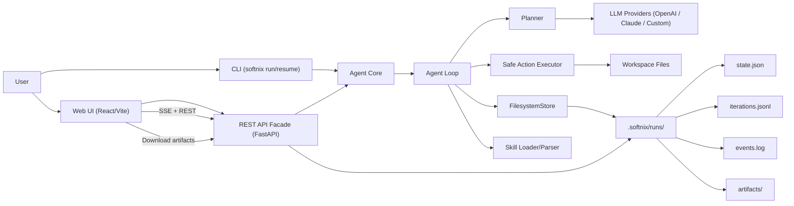

# Softnix Agentic Agent

CLI-first agent framework ที่ทำงานตาม flow:

`Task -> Agent Loop -> Filesystem Persistence -> Loop ต่อ`

รองรับ:
- Skills มาตรฐาน `SKILL.md`
- LLM Providers: `OpenAI`, `Claude`, `OpenAI-compatible custom endpoint`
- Safe action execution (allowlist)
- Core Memory แบบ markdown-first (`memory/PROFILE.md`/`memory/SESSION.md` + pending/inferred flow)
- Local REST API facade สำหรับต่อยอด Desktop/Web

## โครงสร้างหลัก

- `src/softnix_agentic_agent/cli.py` คำสั่ง CLI
- `src/softnix_agentic_agent/agent/loop.py` วน iteration หลัก
- `src/softnix_agentic_agent/agent/planner.py` เรียก LLM เพื่อวางแผน action
- `src/softnix_agentic_agent/agent/executor.py` execute action แบบปลอดภัย
- `src/softnix_agentic_agent/storage/filesystem_store.py` persist state/iterations/events
- `src/softnix_agentic_agent/memory/*` memory store/service สำหรับ profile/session/pending memory
- `src/softnix_agentic_agent/skills/*` parser/loader สำหรับ `SKILL.md`
- `src/softnix_agentic_agent/providers/*` adapter ของ provider
- `src/softnix_agentic_agent/api/app.py` REST facade

## Architecture Diagram



ลำดับการทำงานหลัก:
1. รับ `task` จาก CLI หรือ Web UI
2. Agent Core เริ่ม `Agent Loop` และเรียก `Planner` เพื่อขอแผนจาก LLM Provider
3. `Safe Action Executor` ทำ action ที่อนุญาตและเขียนไฟล์ใน workspace
4. `FilesystemStore` บันทึก state/iterations/events/artifacts ต่อเนื่องทุก iteration
5. Core Memory update/resolve บริบทจาก `memory/PROFILE.md`/`memory/SESSION.md` แล้ว inject เข้า planner prompt
6. API/Web UI อ่านสถานะล่าสุดและ timeline จาก run storage แบบ near real-time

## ติดตั้ง

```bash
python -m venv .venv
source .venv/bin/activate
pip install -e '.[dev]'
```

## ตั้งค่า Environment

คัดลอก `.env.example` และกำหนดค่า API key ตาม provider ที่ใช้
ตัวระบบจะโหลดไฟล์ `.env` อัตโนมัติจาก current working directory ตอนรันคำสั่ง `softnix`

ตัวอย่างที่ต้องมี:
- `SOFTNIX_OPENAI_API_KEY` เมื่อใช้ `openai`
- `SOFTNIX_CLAUDE_API_KEY` เมื่อใช้ `claude`
- `SOFTNIX_CUSTOM_BASE_URL` (+ optional key) เมื่อใช้ `custom`

ตัวเลือกด้าน security:
- `SOFTNIX_API_KEY` เปิด API key protection ให้ทุก endpoint (ยกเว้น `/health`, `/docs`, `/openapi.json`)
- `SOFTNIX_CORS_ORIGINS` กำหนด origin ที่อนุญาต (comma-separated)
- `SOFTNIX_CORS_ALLOW_CREDENTIALS` (`true`/`false`)
- `SOFTNIX_EXEC_TIMEOUT_SEC` timeout ต่อ action ที่รันคำสั่ง/โค้ด
- `SOFTNIX_EXEC_RUNTIME` โหมด execution runtime (`host` หรือ `container`)
- `SOFTNIX_EXEC_CONTAINER_LIFECYCLE` lifecycle ของ container (`per_action` หรือ `per_run`)
- `SOFTNIX_EXEC_CONTAINER_IMAGE` container image ที่ใช้เมื่อ runtime=container
- `SOFTNIX_EXEC_CONTAINER_NETWORK` network mode ของ container runtime (แนะนำ `none`)
- `SOFTNIX_EXEC_CONTAINER_CPUS` จำกัด CPU สำหรับ container runtime
- `SOFTNIX_EXEC_CONTAINER_MEMORY` จำกัด memory สำหรับ container runtime
- `SOFTNIX_EXEC_CONTAINER_PIDS_LIMIT` จำกัดจำนวน process ภายใน container
- `SOFTNIX_MAX_ACTION_OUTPUT_CHARS` จำกัดขนาด output ต่อ action
- `SOFTNIX_WEB_FETCH_TLS_VERIFY` เปิด/ปิด TLS certificate verification สำหรับ `web_fetch` (default `true`)
- `SOFTNIX_MEMORY_PROFILE_FILE` ชื่อไฟล์ profile memory ใน workspace (default `memory/PROFILE.md`)
- `SOFTNIX_MEMORY_SESSION_FILE` ชื่อไฟล์ session memory ใน workspace (default `memory/SESSION.md`)
- `SOFTNIX_MEMORY_POLICY_PATH` path ของ global policy memory (admin-managed only)
- `SOFTNIX_MEMORY_PROMPT_MAX_ITEMS` จำนวน memory items สูงสุดที่ inject เข้า planner prompt
- `SOFTNIX_MEMORY_INFERRED_MIN_CONFIDENCE` ค่าขั้นต่ำ (0-1) สำหรับ staging inferred memory
- `SOFTNIX_MEMORY_PENDING_ALERT_THRESHOLD` จำนวน pending ขั้นต่ำที่จะเริ่ม log alert backlog
- `SOFTNIX_MEMORY_ADMIN_KEY` คีย์สำหรับ admin-only memory endpoints (เช่น policy reload)
- `SOFTNIX_TELEGRAM_ENABLED` เปิด/ปิด Telegram Gateway (`true`/`false`)
- `SOFTNIX_TELEGRAM_MODE` โหมด gateway (`polling` หรือ `webhook`)
- `SOFTNIX_TELEGRAM_BOT_TOKEN` bot token จาก Telegram
- `SOFTNIX_TELEGRAM_ALLOWED_CHAT_IDS` รายการ chat id ที่อนุญาต (comma-separated)
- `SOFTNIX_TELEGRAM_WEBHOOK_SECRET` secret token สำหรับ verify webhook header
- `SOFTNIX_TELEGRAM_POLL_INTERVAL_SEC` polling interval (ใช้กับ worker/poll mode)
- `SOFTNIX_TELEGRAM_MAX_TASK_CHARS` จำกัดความยาว task ผ่าน `/run`

## การใช้งาน CLI

### 1) Run task

```bash
softnix run --task "Build a Python course" --provider openai --max-iters 10 --workspace . --skills-dir skillpacks
```

### 2) Resume run เดิม

```bash
softnix resume --run-id <run_id>
```

### 3) List skills

```bash
softnix skills list --path skillpacks
```

### 4) เปิด API

```bash
softnix api serve --host 127.0.0.1 --port 8787
```

## REST API

- `POST /runs` เริ่ม run ใหม่
- `GET /runs` อ่านรายการ runs
- `GET /runs/{id}` อ่านสถานะ run
- `GET /runs/{id}/iterations` อ่าน iteration logs
- `GET /runs/{id}/stream` stream ความคืบหน้าแบบ SSE
- `GET /runs/{id}/stream?last_event_id=<n>` resume stream จาก event id ล่าสุด
- `GET /runs/{id}/events` อ่าน events log
- `GET /runs/{id}/memory/pending` อ่าน inferred pending memory ที่รอการยืนยัน
- `POST /runs/{id}/memory/confirm` ยืนยัน pending memory ด้วย key แบบ explicit
- `POST /runs/{id}/memory/reject` ปฏิเสธ pending memory ด้วย key แบบ explicit
- `GET /runs/{id}/memory/metrics` อ่าน memory metrics (pending backlog / compact failures / policy tools)
- `POST /admin/memory/policy/reload` trigger policy reload summary (ต้องใช้ `x-memory-admin-key`)
- `POST /runs/{id}/cancel` ส่งคำขอหยุด run
- `POST /runs/{id}/resume` สั่ง resume run
- `GET /skills` อ่านรายการ skills
- `GET /artifacts/{id}` อ่านรายการ artifacts
- `GET /artifacts/{id}/{path}` ดาวน์โหลด artifact
- `GET /health` ตรวจสถานะ provider connectivity/config
- `GET /system/config` อ่าน effective runtime config (safe fields)
- `POST /telegram/webhook` รับ Telegram webhook update (public endpoint, แนะนำให้เปิด secret verify)
- `POST /telegram/poll` ดึง updates แบบ manual 1 รอบ (สำหรับ dev/polling)

เมื่อเปิด `SOFTNIX_API_KEY`:
- ทุก request ที่เข้าถึง API หลักต้องส่ง header `x-api-key: <your-key>`
- CORS preflight (`OPTIONS`) ยังทำงานได้ปกติสำหรับ origin ที่ allow ไว้
- `POST /telegram/webhook` ยังเป็น public path เพื่อรองรับ Telegram callback โดยให้ป้องกันด้วย `SOFTNIX_TELEGRAM_WEBHOOK_SECRET`

## Web UI (ChatGPT-like)

โฟลเดอร์ `web-ui/` เป็น frontend สำหรับใช้งานกับ API backend โดยใช้:
- React + Vite
- Tailwind CSS + shadcn-style components
- Framer Motion animations
- Streaming markdown renderer และ AI-native UI blocks

### รัน Backend

```bash
softnix api serve --host 127.0.0.1 --port 8787
```

ควรเปิด `venv` ก่อนทุกครั้ง:

```bash
source .venv/bin/activate
```

### รัน Web UI

```bash
cd web-ui
npm install
npm run dev
```

ค่า default API คือ `http://127.0.0.1:8787` และ override ได้ด้วย env:

```bash
VITE_API_BASE_URL=http://127.0.0.1:8787
VITE_SOFTNIX_API_KEY=
VITE_SOFTNIX_MEMORY_ADMIN_KEY=
```

หมายเหตุ:
- หากตั้ง `VITE_SOFTNIX_MEMORY_ADMIN_KEY` Web UI จะแสดงปุ่ม `Reload Policy` (เรียก `POST /admin/memory/policy/reload`)

### เข้าใช้งาน Web UI

1. เปิดเบราว์เซอร์ที่ `http://127.0.0.1:5173`
2. กรอก task/provider/model แล้วกด `Start Run`
3. ดู conversation timeline และใช้ปุ่ม `Cancel`/`Resume` ได้ตรงนี้เลย

ข้อจำกัดปัจจุบันของ Web UI:
- ยังไม่มีหน้าจัดการ policy admin (reload ยังเรียกผ่าน API)

## Telegram Setup (MVP)

หัวข้อนี้ออกแบบสำหรับ dev local ที่ยังไม่มี public server โดยใช้ `ngrok` เพื่อเปิด webhook

### A) สิ่งที่ต้องมี

1. Telegram bot token จาก `@BotFather`
2. `ngrok` ติดตั้งและใช้งานได้
3. backend รันที่ `http://127.0.0.1:8787`

### B) หา `chat_id` (ทำครั้งเดียว)

1. ส่งข้อความหา bot (เช่น `/start`)
2. เรียก:

```bash
curl -sS "https://api.telegram.org/bot<YOUR_BOT_TOKEN>/getUpdates"
```

3. อ่านค่า `message.chat.id` แล้วนำไปใส่ `SOFTNIX_TELEGRAM_ALLOWED_CHAT_IDS`

ตัวอย่างจาก JSON:
- `"chat":{"id":8388377631,...}` -> `SOFTNIX_TELEGRAM_ALLOWED_CHAT_IDS=8388377631`

### C) ปรับ `.env` (อิงจาก config ปัจจุบัน)

ถ้าตอนนี้คุณใช้ `SOFTNIX_TELEGRAM_MODE=polling` และไม่อยากเรียก poll เองทุกครั้ง ให้เปลี่ยนเป็น `webhook`:

```bash
SOFTNIX_TELEGRAM_ENABLED=true
SOFTNIX_TELEGRAM_MODE=webhook
SOFTNIX_TELEGRAM_BOT_TOKEN=<YOUR_BOT_TOKEN>
SOFTNIX_TELEGRAM_ALLOWED_CHAT_IDS=8388377631
SOFTNIX_TELEGRAM_WEBHOOK_SECRET=<SET_REAL_SECRET>
SOFTNIX_TELEGRAM_MAX_TASK_CHARS=2000
```

หมายเหตุ:
- ค่า `<RANDOM_SECRET>` หรือ placeholder ต้องเปลี่ยนเป็น secret จริงก่อนใช้งาน
- ถ้ามีหลาย chat ให้คั่น comma เช่น `8388377631,-1001122334455`

### D) เปิด backend + ngrok

1. รัน backend:

```bash
softnix api serve --host 127.0.0.1 --port 8787
```

2. เปิด ngrok tunnel:

```bash
ngrok http 8787
```

3. คัดลอก HTTPS URL จาก ngrok เช่น `https://abcd-1234.ngrok-free.app`

### E) ตั้ง Telegram Webhook

```bash
curl -sS "https://api.telegram.org/bot<YOUR_BOT_TOKEN>/setWebhook" \
  -H "Content-Type: application/json" \
  -d '{"url":"https://<NGROK_HOST>/telegram/webhook","secret_token":"<SET_REAL_SECRET>"}'
```

ตรวจสอบ webhook:

```bash
curl -sS "https://api.telegram.org/bot<YOUR_BOT_TOKEN>/getWebhookInfo"
```

ค่าที่ควรเช็ก:
- `url` ตรงกับ ngrok host
- `pending_update_count` ไม่ค้างสูงผิดปกติ
- `last_error_message` ว่าง

### F) ทดสอบใช้งาน

ส่งข้อความใน Telegram:
- `/help`
- `/run สรุปเว็บไซต์ https://www.softnix.co.th/softnix-logger/`
- `/status <run_id>`
- `/cancel <run_id>`
- `/resume <run_id>`

### G) Troubleshooting ที่พบบ่อย

1. Bot ไม่ตอบ:
- เช็กว่า `.env` ตั้ง `SOFTNIX_TELEGRAM_MODE=webhook` แล้ว
- เช็กว่า backend restart หลังแก้ `.env`
- เช็ก `SOFTNIX_TELEGRAM_ALLOWED_CHAT_IDS` เป็น chat id จริง
- เช็ก `getWebhookInfo` ว่าไม่มี error

2. ได้ 401 ที่ `/telegram/webhook`:
- ค่า `secret_token` ตอน `setWebhook` ไม่ตรง `SOFTNIX_TELEGRAM_WEBHOOK_SECRET`

3. ใช้ `SOFTNIX_API_KEY`:
- endpoint `/telegram/webhook` รับ callback ได้โดยไม่ต้อง `x-api-key`
- endpoint อื่นยังต้องใช้ `x-api-key` ตามปกติ

## Deployment Config

มี deployment templates แยก environment สำหรับ backend/frontend ที่ `deploy/env/`

ไฟล์สำคัญ:
- `deploy/env/backend.dev.template`
- `deploy/env/backend.staging.template`
- `deploy/env/backend.prod.template`
- `deploy/env/frontend.dev.template`
- `deploy/env/frontend.staging.template`
- `deploy/env/frontend.prod.template`

ดูขั้นตอนใช้งานทั้งหมดที่ `deploy/README.md`
และไฟล์ compose พร้อมใช้ที่:
- `deploy/docker-compose.dev.yml`
- `deploy/docker-compose.staging.yml`

## รูปแบบไฟล์ Persistence

สำหรับแต่ละ run จะถูกเก็บที่:

- `.softnix/runs/<run_id>/state.json`
- `.softnix/runs/<run_id>/iterations.jsonl`
- `.softnix/runs/<run_id>/artifacts/`
- `.softnix/runs/<run_id>/events.log`

## Safe Execution Policy

Action ที่รองรับในรุ่นแรก:
- `list_dir`
- `read_file`
- `write_workspace_file`
- `write_file` (alias ของ `write_workspace_file`)
- `run_safe_command`
- `run_shell_command` (alias ของ `run_safe_command`)
- `run_python_code`
- `web_fetch`

ข้อจำกัด:
- ห้าม path ออกนอก workspace
- shell command ต้องอยู่ใน allowlist (`SOFTNIX_SAFE_COMMANDS`)
- รองรับ alias `python3 -> python` อัตโนมัติสำหรับ `run_safe_command` และ `run_python_code` (เมื่อ `python` อยู่ใน allowlist)
- `run_safe_command` รองรับพารามิเตอร์แบบ structured:
  - `command` (จำเป็น): executable/command
  - `args` (optional): list ของ argument เช่น `["install_and_check.py"]`
  - `stdout_path` / `stderr_path` (optional): บันทึก stdout/stderr ลงไฟล์ใน workspace โดยไม่ต้องใช้ shell redirection
  - backward compatible กับ `redirect_output` / `output_file` (legacy)
- token เสี่ยง (`sudo`, `curl`, `wget`, `ssh`, `scp`, `mv`) ถูก block
- `rm` อนุญาตเมื่ออยู่ใน allowlist และลบได้เฉพาะ path ภายใน workspace
- เมื่อ `SOFTNIX_EXEC_RUNTIME=container` ระบบจะรัน `run_safe_command`/`run_python_code` ผ่าน `docker run` พร้อม resource/network limits

### Container Runtime (P0)

ตัวอย่างเปิดโหมด container sandbox:

```bash
SOFTNIX_EXEC_RUNTIME=container
SOFTNIX_EXEC_CONTAINER_LIFECYCLE=per_run
SOFTNIX_EXEC_CONTAINER_IMAGE=python:3.11-slim
SOFTNIX_EXEC_CONTAINER_IMAGE_PROFILE=auto
SOFTNIX_EXEC_CONTAINER_IMAGE_BASE=python:3.11-slim
SOFTNIX_EXEC_CONTAINER_IMAGE_WEB=python:3.11-slim
SOFTNIX_EXEC_CONTAINER_IMAGE_DATA=softnix/runtime-data:py311
SOFTNIX_EXEC_CONTAINER_IMAGE_ML=softnix/runtime-ml:py311
SOFTNIX_EXEC_CONTAINER_NETWORK=none
SOFTNIX_EXEC_CONTAINER_CPUS=1.0
SOFTNIX_EXEC_CONTAINER_MEMORY=512m
SOFTNIX_EXEC_CONTAINER_PIDS_LIMIT=256
SOFTNIX_EXEC_CONTAINER_CACHE_DIR=.softnix/container-cache
SOFTNIX_EXEC_CONTAINER_PIP_CACHE_ENABLED=true
```

หมายเหตุ:
- เครื่องที่รัน backend ต้องมี Docker
- สำหรับงาน data/ml แนะนำ build prebuilt runtime image ก่อนใช้งาน:
  ```bash
  ./scripts/build_runtime_images.sh
  ```
  script นี้จะ build:
  - `softnix/runtime-data:py311` (มี numpy/pandas/scipy และ web parsing libs)
  - `softnix/runtime-ml:py311` (เพิ่ม scikit-learn/matplotlib)
- โหมด `per_run` จะสร้าง container หนึ่งตัวต่อ run แล้วใช้ `docker exec` สำหรับ action ถัดไป เพื่อลด overhead และคง dependency ระหว่าง action ใน run เดียวกัน
- รองรับ pip dependency cache ข้าม run ผ่าน mount path `SOFTNIX_EXEC_CONTAINER_CACHE_DIR` (เปิด/ปิดด้วย `SOFTNIX_EXEC_CONTAINER_PIP_CACHE_ENABLED`)
- รองรับ image profile strategy:
  - `auto`: เลือก profile จาก task/skills (`scraping|ml|qa|web|data|base`) อัตโนมัติ
  - `base|web|data|scraping|ml|qa`: บังคับ profile ตายตัว
  - image ของแต่ละ profile กำหนดได้ผ่าน:
    - `SOFTNIX_EXEC_CONTAINER_IMAGE_BASE`
    - `SOFTNIX_EXEC_CONTAINER_IMAGE_WEB`
    - `SOFTNIX_EXEC_CONTAINER_IMAGE_DATA`
    - `SOFTNIX_EXEC_CONTAINER_IMAGE_SCRAPING`
    - `SOFTNIX_EXEC_CONTAINER_IMAGE_ML`
    - `SOFTNIX_EXEC_CONTAINER_IMAGE_QA`
- action `web_fetch` ยังเป็น HTTP client ของ backend process (ไม่รันใน container runtime)

ความหมายของ `SOFTNIX_EXEC_CONTAINER_LIFECYCLE`:
- `per_action`
  - สร้าง container ใหม่ทุก action (`docker run --rm` ต่อครั้ง)
  - ปลอดภัยและแยก execution ดีที่สุดในเชิง action-level
  - overhead สูงกว่า และ dependency ที่ติดตั้งใน action ก่อนหน้าจะไม่คงอยู่
  - เหมาะกับงานสั้น/ง่าย หรือเน้น isolation สูง
- `per_run`
  - สร้าง container 1 ตัวต่อ run แล้ว reuse ด้วย `docker exec`
  - overhead ต่ำกว่า และ state/dependency ภายใน container คงอยู่ตลอด run เดียวกัน
  - พฤติกรรมใกล้ host มากกว่า เหมาะกับ autonomous task ที่วนเขียน/รัน/แก้หลายรอบ
  - เมื่อ run จบ ระบบจะ cleanup container อัตโนมัติ

### Objective Validation (P0)

- เมื่อ planner ตอบ `done=true` ระบบจะรัน objective validation ก่อนสรุปผลทุกครั้ง
- รองรับ validation จากแผน (`plan.validations`) เช่น:
  - `{"type":"file_exists","path":"result.txt"}`
  - `{"type":"text_in_file","path":"result.txt","contains":"success"}`
- รองรับ `{"type":"python_import","path":"calculate_stats.py","module":"numpy"}` เพื่อบังคับการใช้ module เฉพาะในไฟล์ Python
- auto-infer validation จาก task สำหรับ requirement library:
  - ถ้า task ระบุ `numpy`/`pandas`/`scipy` และมีไฟล์ `.py` เป็น output ระบบจะตรวจว่าไฟล์นั้น import module ที่ระบุจริงก่อนสรุปผลว่า completed
- หาก validation ไม่ผ่าน ระบบจะบังคับ `done=false` และใส่เหตุผลลง output/events เพื่อให้ agent iterate ต่อ

### No-progress Detection (P0)

- ระบบตรวจลูปซ้ำที่ไม่เกิดความคืบหน้า (plan/actions/results/output ซ้ำกันหลายรอบ)
- หากเกิน threshold (`SOFTNIX_NO_PROGRESS_REPEAT_THRESHOLD`, default `3`) จะหยุด run ด้วย `stop_reason=no_progress`
- event จะระบุ `signature=<hash>` และ `actions=<...>` เพื่อช่วย debug root cause ใน timeline
- ช่วยลดการวนจน `max_iters` โดยไม่คืบหน้า

## Core Memory (Markdown-first)

- ระบบสร้างและใช้ `memory/PROFILE.md` และ `memory/SESSION.md` ใน workspace อัตโนมัติ
- หากพบไฟล์เดิมที่ root (`PROFILE.md`/`SESSION.md`) ระบบจะย้ายเข้า `memory/` อัตโนมัติเมื่อเริ่ม run
- รองรับคำสั่งจากผู้ใช้แบบธรรมชาติ เช่น `จำไว้ว่า response.tone = concise`
- รองรับ TTL ในคำสั่งจำแบบ explicit เช่น `remember response.verbosity = concise for 8h`
- รองรับ inferred preference แบบ pending (ยังไม่ commit ถาวร) จากข้อความเช่น `ขอสั้นๆ`, `ขอเป็นข้อๆ`
- ยืนยัน pending ด้วย `ยืนยันให้จำ <key>` หรือยกเลิกด้วย `ไม่ต้องจำ <key>`
- เฉพาะ inferred ที่มี confidence มากกว่าหรือเท่ากับ `SOFTNIX_MEMORY_INFERRED_MIN_CONFIDENCE` เท่านั้นที่จะถูก stage
- memory ที่ resolve แล้วจะถูก inject เข้า planner prompt ทุก iteration
- มี auto compact ต่อ iteration สำหรับลบ memory ที่หมดอายุและ deduplicate key ซ้ำใน `memory/PROFILE.md`/`memory/SESSION.md`
- audit การเปลี่ยน memory ถูกเก็บที่ `.softnix/runs/<run_id>/memory_audit.jsonl`
- `POLICY.md` ถูกออกแบบให้เป็น admin-managed only และอยู่นอก user workspace path ปกติ
- มี endpoint ตรวจ pending memory: `GET /runs/{run_id}/memory/pending`
- มี endpoint ยืนยัน/ปฏิเสธ pending แบบ explicit:
  - `POST /runs/{run_id}/memory/confirm`
  - `POST /runs/{run_id}/memory/reject`
- มี endpoint metrics สำหรับ observability: `GET /runs/{run_id}/memory/metrics`
- support policy guard (`policy.allow.tools`) แบบ hot-reload ต่อ iteration และบล็อก action ที่ไม่ถูกอนุญาต
- รองรับ admin policy reload endpoint: `POST /admin/memory/policy/reload` (ใช้ `SOFTNIX_MEMORY_ADMIN_KEY`)

### One-click test script

รันสคริปต์ทดสอบครบ flow หลัก (explicit, ttl, inferred-pending, confirm, reject):

```bash
cd /Volumes/Seagate/myapp/Softnix-Agentic-Agent
./scripts/test_core_memory_oneclick.sh
```

หมายเหตุ:
- สคริปต์จะพยายาม start backend อัตโนมัติ (ใช้ `softnix` หรือ `.venv/bin/softnix` หรือ `uv run softnix`)
- หากมี backend รันอยู่แล้ว จะใช้ instance นั้นทันที
- สามารถ override ได้ด้วย `API_BASE=http://127.0.0.1:8787 ./scripts/test_core_memory_oneclick.sh`

## หมายเหตุสำหรับ Desktop/Web

รุ่นปัจจุบันมี Web UI ใช้งานได้แล้วสำหรับ run/timeline/artifacts และการควบคุม run พื้นฐาน
โดย memory confirmation flow ยังใช้แนวทางผ่าน task text/API เป็นหลัก
