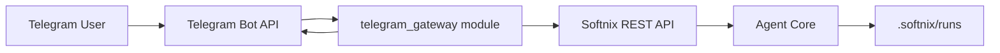

# Telegram Gateway Spec

สถานะ: Draft v1
ขอบเขต: External command channel ผ่าน Telegram เพื่อสั่งงาน Agent Core และรับผลลัพธ์กลับใน chat

## 1. Goals

- ให้ผู้ใช้สั่ง run และติดตามผลผ่าน Telegram โดยไม่ต้องเข้า Web UI
- รองรับคำสั่งควบคุมพื้นฐาน (`run/status/cancel/resume/pending`)
- ออกแบบให้ปลอดภัยต่อการใช้งานจริง (allowed chat, rate limit, idempotency)

## 2. Non-Goals (v1)

- ไม่ทำ rich interactive UI เต็มรูปแบบใน Telegram (inline keyboard ขั้นสูง)
- ไม่รองรับ multi-tenant auth model เต็มรูปแบบในเฟสแรก
- ไม่แทนที่ Web UI (เป็น channel เสริม)

## 3. High-level Architecture

หลักการ:
- `telegram_gateway` เป็น adapter layer
- logic การ execute/run อยู่ในระบบเดิม (REST API + Agent Core)
- gateway แปลคำสั่ง Telegram -> REST call และแปลผลกลับเป็นข้อความ Telegram

## 4. Runtime Modes

1. `polling`
- เหมาะกับ local/dev
- ดึง updates จาก `getUpdates` แบบ loop

2. `webhook`
- เหมาะกับ production
- รับ POST callback จาก Telegram
- ต้องมี secret verification และ HTTPS endpoint

## 5. Command Contract (v1)

1. `/run <task>`
- เริ่ม run ใหม่
- response: `run_id`, status เริ่มต้น, hint คำสั่งต่อไป

2. `/status <run_id>`
- อ่านสถานะ run ล่าสุด (`running/completed/failed/canceled` + iteration)

3. `/cancel <run_id>`
- ส่งคำขอหยุด run

4. `/resume <run_id>`
- resume run ที่หยุดค้าง

5. `/pending <run_id>`
- อ่าน inferred pending memory จาก `GET /runs/{run_id}/memory/pending`

6. `/skills`
- แสดงรายการ skills ที่ระบบโหลดได้จาก `skills_dir`

7. `/help`
- แสดงรายการคำสั่งและตัวอย่างการใช้

หมายเหตุ:
- กรณี command ผิดรูปแบบ ให้ตอบ usage ที่ถูกต้องเสมอ
- จำกัดขนาดข้อความขาเข้าเพื่อป้องกัน abuse (เช่น max task length)

## 6. Response Templates

ตัวอย่าง `/run`:
- `Started run: <run_id>`
- `Task: <truncated_task>`
- `Use /status <run_id> to check progress`

ตัวอย่าง `/status`:
- `Run <run_id>: running`
- `iteration: 3/10`
- `updated_at: ...`

ตัวอย่าง `/pending`:
- ถ้ามีรายการ: list แบบ bullet (`target_key=value`)
- ถ้าไม่มี: `No pending memory`

## 7. Security Requirements

1. Chat allowlist
- อนุญาตเฉพาะ `SOFTNIX_TELEGRAM_ALLOWED_CHAT_IDS`
- chat ไม่อยู่ allowlist -> ปฏิเสธทันที

2. Bot token handling
- ใช้ `SOFTNIX_TELEGRAM_BOT_TOKEN` จาก env เท่านั้น
- ห้าม log token

3. Webhook security (mode webhook)
- verify secret header/token
- enforce HTTPS

4. Anti-abuse
- per-chat rate limit (เช่น 1 command/second, burst limit)
- message size limit

5. Audit trail
- บันทึก mapping `chat_id`, `user_id`, `command`, `run_id`, timestamp

## 8. Config Contract

- `SOFTNIX_TELEGRAM_ENABLED` (`true|false`)
- `SOFTNIX_TELEGRAM_MODE` (`polling|webhook`)
- `SOFTNIX_TELEGRAM_BOT_TOKEN`
- `SOFTNIX_TELEGRAM_ALLOWED_CHAT_IDS` (comma-separated)
- `SOFTNIX_TELEGRAM_WEBHOOK_SECRET` (สำหรับ webhook mode)
- `SOFTNIX_TELEGRAM_POLL_INTERVAL_SEC` (default เช่น 1.0)
- `SOFTNIX_TELEGRAM_MAX_TASK_CHARS` (default เช่น 2000)
- `SOFTNIX_TELEGRAM_RATE_LIMIT_PER_MINUTE` (default 30)
- `SOFTNIX_TELEGRAM_COOLDOWN_SEC` (default 0.0)
- `SOFTNIX_TELEGRAM_DEDUP_MAX_IDS` (default 1000)
- `SOFTNIX_TELEGRAM_AUDIT_ENABLED` (default true)
- `SOFTNIX_TELEGRAM_AUDIT_PATH` (default `.softnix/telegram/audit.jsonl`)

## 9. Module Structure (proposed)

- `src/softnix_agentic_agent/integrations/telegram_gateway.py`
- `src/softnix_agentic_agent/integrations/telegram_client.py`
- `src/softnix_agentic_agent/integrations/telegram_parser.py`
- `src/softnix_agentic_agent/integrations/telegram_templates.py`

Responsibilities:
- `telegram_client`: HTTP call ไป Telegram Bot API
- `telegram_parser`: parse command + validate argument
- `telegram_templates`: format response text
- `telegram_gateway`: orchestrate command flow กับ REST API

## 10. Internal API Calls Used

- `POST /runs`
- `GET /runs/{run_id}`
- `POST /runs/{run_id}/cancel`
- `POST /runs/{run_id}/resume`
- `GET /runs/{run_id}/memory/pending`

## 11. Error Handling

- Telegram API timeout: retry แบบ bounded (max retries)
- REST API 4xx: ส่งข้อความอธิบาย user error
- REST API 5xx/network: ส่งข้อความ transient error + แนะนำ retry
- Unknown command: fallback ไป `/help`

## 12. Observability

Metrics ขั้นต่ำ:
- command count by type (`run/status/...`)
- reject count (unauthorized chat)
- telegram api error count
- command latency (gateway -> final response)
- duplicate update dropped count
- rate limit/cooldown rejection count

Logs ขั้นต่ำ:
- `chat_id`, `command`, `run_id`, status, error summary
- แนะนำเปิด audit endpoint เพื่อ query mapping (`GET /telegram/audit`)

## 13. Testing Plan

Unit tests:
- parser command coverage
- template rendering
- allowlist/rate-limit checks

Integration tests:
- mock Telegram API + mock Softnix API
- test full command lifecycle (`/run` -> `/status` -> `/cancel`)

Manual tests:
- polling mode local
- webhook mode staging
- unauthorized chat rejection

## 14. Rollout Plan

Phase 1 (MVP)
- polling mode
- commands: `/run`, `/status`, `/cancel`, `/resume`, `/pending`, `/skills`, `/help`
- allowlist + basic logging

Phase 2 (Hardening)
- webhook mode + secret verification
- idempotency/dedup + retry policy
- rate-limit และ stronger audit

Phase 3 (UX)
- message chunking
- artifact sendDocument
- progress push แบบ throttled

## 15. Open Decisions

- จะ push progress อัตโนมัติหรือ on-demand (`/status`) เป็น default
- นโยบายเก็บ history mapping chat<->run
- ระดับสิทธิ์ใน group chats (command จากใครได้บ้าง)
